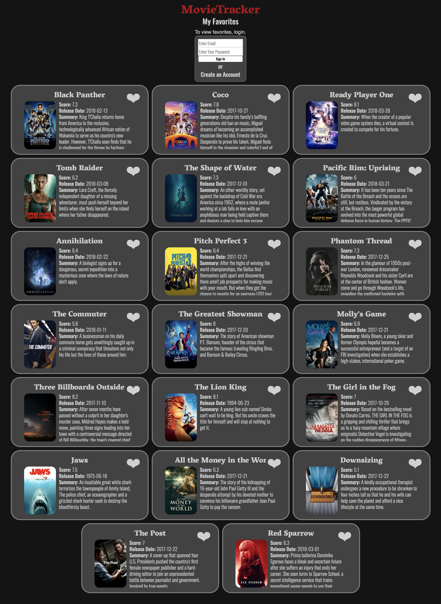

# Movie Tracker

## Group: Kailin Cannon, Sabrina Kennedy, and Charles Yach

## Description

This project served as practice with using Redux-react, React, BrowserRouter, Async Await, and a PostgreSQL backend server. For this project we started with the 'create-react-app' boilerplate to make a NetFLIX like app that pulls in current movies from the moveDB api, keeps track of user information by posting to the backend, and lets the user store their favorite in both the redux store and PostgreSQL backend. Jest, Enzyme, and manual mock implementation were used to test the app along with PropTypes to validate props passed to each component.

## Set Up

### API

Visit https://www.themoviedb.org/documentation/api to create an account to get an API key.

You will need to store this key in a file `./src/apiKey.js` saved as a variable named apiKey.

### Back-end

Clone backend repository at https://github.com/turingschool-examples/movie-tracker

If you dont have PostgreSQL installed, follow the repo's README.

Once PostgreSQL is installed, run `npm install`, run `npm start`.

### Front-end

Clone this project

Run `npm install` from the root directory

Run `npm start`

You can run the testing suite with `npm test`.

## Future

Additional data is available for categories other than "currently playing". We would like to incorporate this into multiple pages on the site along with pulling up additional data for each individual movie. We would also like to make it an option to store a users login on page refresh. 

## Screenshot
